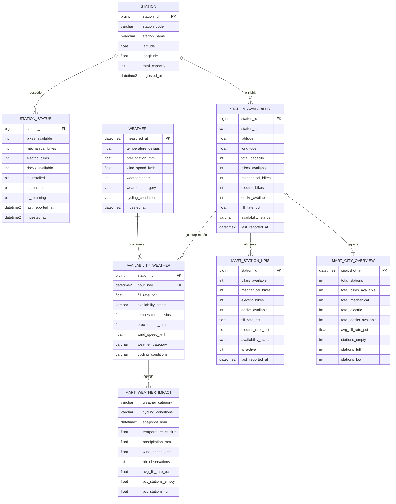

# VelibData — Modèles de Données

## Architecture Medallion

```
API Vélib (station_status) ──┐
API Vélib (station_info)   ──┼──► ADLS Bronze ──► Silver (dbt) ──► Gold (dbt) ──► Marts ──► Power BI
API Open-Meteo (weather)   ──┘
```

---

## 1. MCD — Modèle Conceptuel des Données

Le MCD représente les concepts métier sans considération technique.

### Entités

| Entité | Description |
|---|---|
| **STATION** | Une station Vélib physique à Paris |
| **STATUT_STATION** | Instantané temps-réel de la disponibilité d'une station |
| **MÉTÉO** | Conditions météorologiques horaires à Paris |

### Propriétés

**STATION**
- Identifiant station
- Code station
- Nom de la station
- Latitude
- Longitude
- Capacité totale

**STATUT_STATION**
- Vélos disponibles
- Vélos mécaniques
- Vélos électriques
- Bornes libres
- Est installée
- Est en service (location)
- Est en service (retour)
- Dernière mise à jour

**MÉTÉO**
- Heure de mesure
- Température (°C)
- Précipitations (mm)
- Vitesse du vent (km/h)
- Code météo WMO
- Catégorie météo
- Conditions cyclisme

### Associations

```
STATION (1,1) ────────── possède ────────── (0,N) STATUT_STATION
                          │
STATUT_STATION (0,N) ── observée lors de ── (0,N) MÉTÉO
                         (via heure arrondie)
```

**Cardinalités :**
- Une station possède plusieurs statuts dans le temps (1,1 → 0,N)
- Un statut de station est observé lors d'une ou aucune condition météo (0,N → 0,N)

---

## 2. ERD — Entity-Relationship Diagram



---

## 3. MLD — Modèle Logique des Données

Notation : `#` = clé primaire, `→` = clé étrangère

### Couche Bronze — Données brutes (ADLS Gen2 + Azure SQL)

```
station_info(
    #station_id,
    stationCode,
    name,
    capacity,
    lat,
    lon,
    ingested_at
)

station_status(
    #station_id,
    #ingested_at,
    stationCode,
    num_bikes_available,
    num_docks_available,
    num_bikes_available_types [JSON],
    is_installed,
    is_renting,
    is_returning,
    last_reported
)

weather(
    #time,
    temperature_2m,
    precipitation,
    windspeed_10m,
    weathercode,
    ingested_at
)
```

### Couche Silver — Données nettoyées (dbt staging)

```
stg_station_info(
    #station_id,
    station_code,
    station_name,
    total_capacity,
    latitude,
    longitude,
    ingested_at
)

stg_station_status(
    #station_id → stg_station_info,
    #last_reported_at,
    station_code,
    bikes_available,
    docks_available,
    mechanical_bikes,
    electric_bikes,
    is_installed,
    is_renting,
    is_returning,
    ingested_at
)

stg_weather(
    #measured_at,
    temperature_celsius,
    precipitation_mm,
    wind_speed_kmh,
    weather_code,
    ingested_at
)
```

### Couche Gold — Données enrichies (dbt intermediate)

```
int_station_availability(
    #station_id → stg_station_info,
    #last_reported_at,
    station_code,
    station_name,
    latitude,
    longitude,
    total_capacity,
    bikes_available,
    mechanical_bikes,
    electric_bikes,
    docks_available,
    fill_rate_pct,        [calculé : bikes_available / total_capacity * 100]
    availability_status,  [calculé : empty / low / normal / high / full]
    is_installed,
    is_renting,
    is_returning,
    ingested_at
)

int_availability_weather(
    #station_id → int_station_availability,
    #hour_key → stg_weather.measured_at (arrondi à l'heure),
    station_name,
    latitude,
    longitude,
    total_capacity,
    bikes_available,
    mechanical_bikes,
    electric_bikes,
    docks_available,
    fill_rate_pct,
    availability_status,
    temperature_celsius,
    precipitation_mm,
    wind_speed_kmh,
    weather_code,
    weather_category,     [calculé : clear / cloudy / rain / snow / storm]
    cycling_conditions,   [calculé : ideal / good / moderate / bad]
    last_reported_at,
    ingested_at
)
```

### Couche Marts — Données analytiques (dbt marts → Power BI)

```
mart_station_kpis(
    #station_id → int_station_availability,
    station_code,
    station_name,
    latitude,
    longitude,
    total_capacity,
    bikes_available,
    mechanical_bikes,
    electric_bikes,
    docks_available,
    fill_rate_pct,
    electric_ratio_pct,   [calculé : electric_bikes / bikes_available * 100]
    availability_status,
    is_active,            [calculé : is_installed AND is_renting AND is_returning]
    last_reported_at
)

mart_city_overview(
    #snapshot_at,
    total_stations,
    total_bikes_available,
    total_mechanical,
    total_electric,
    total_docks_available,
    total_capacity,
    avg_fill_rate_pct,
    stations_empty,
    stations_full,
    stations_low
)

mart_weather_impact(
    #weather_category,
    #cycling_conditions,
    #snapshot_hour,
    temperature_celsius,
    precipitation_mm,
    wind_speed_kmh,
    nb_observations,
    avg_fill_rate_pct,
    avg_bikes_available,
    avg_electric_bikes,
    avg_mechanical_bikes,
    pct_stations_empty,
    pct_stations_full
)
```

---

## 4. MPD — Modèle Physique des Données

Implémentation Azure SQL Server (T-SQL).

### Schéma Bronze — Tables de staging brut

```sql
CREATE SCHEMA bronze;
GO

CREATE TABLE bronze.station_info (
    station_id      BIGINT          NOT NULL,
    stationCode     VARCHAR(10)     NOT NULL,
    name            NVARCHAR(200)   NOT NULL,
    capacity        INT             NOT NULL,
    lat             FLOAT           NOT NULL,
    lon             FLOAT           NOT NULL,
    ingested_at     DATETIME2       NOT NULL DEFAULT GETUTCDATE(),
    CONSTRAINT PK_bronze_station_info PRIMARY KEY (station_id)
);

CREATE TABLE bronze.station_status (
    station_id                  BIGINT          NOT NULL,
    stationCode                 VARCHAR(10)     NOT NULL,
    num_bikes_available         INT             NOT NULL,
    num_docks_available         INT             NOT NULL,
    num_bikes_available_types   NVARCHAR(MAX),
    is_installed                BIT             NOT NULL,
    is_renting                  BIT             NOT NULL,
    is_returning                BIT             NOT NULL,
    last_reported               BIGINT          NOT NULL,
    ingested_at                 DATETIME2       NOT NULL DEFAULT GETUTCDATE(),
    CONSTRAINT PK_bronze_station_status PRIMARY KEY (station_id, ingested_at)
);
CREATE INDEX IX_bronze_station_status_station_id ON bronze.station_status (station_id);

CREATE TABLE bronze.weather (
    time            DATETIME2   NOT NULL,
    temperature_2m  FLOAT       NOT NULL,
    precipitation   FLOAT,
    windspeed_10m   FLOAT,
    weathercode     INT,
    ingested_at     DATETIME2   NOT NULL DEFAULT GETUTCDATE(),
    CONSTRAINT PK_bronze_weather PRIMARY KEY (time)
);
```

### Schéma Silver — Vues nettoyées (générées par dbt)

```sql
CREATE SCHEMA silver;
GO

-- Généré par dbt : stg_station_info
CREATE VIEW silver.stg_station_info AS
SELECT
    station_id                      AS station_id,
    stationCode                     AS station_code,
    name                            AS station_name,
    capacity                        AS total_capacity,
    lat                             AS latitude,
    lon                             AS longitude,
    ingested_at
FROM bronze.station_info
WHERE station_id IS NOT NULL;

-- Généré par dbt : stg_station_status
CREATE VIEW silver.stg_station_status AS
SELECT
    station_id,
    stationCode                                                 AS station_code,
    num_bikes_available                                         AS bikes_available,
    num_docks_available                                         AS docks_available,
    JSON_VALUE(num_bikes_available_types, '$[0].mechanical')    AS mechanical_bikes,
    JSON_VALUE(num_bikes_available_types, '$[1].ebike')         AS electric_bikes,
    is_installed,
    is_renting,
    is_returning,
    DATEADD(SECOND, last_reported, '1970-01-01')               AS last_reported_at,
    ingested_at
FROM bronze.station_status;

-- Généré par dbt : stg_weather
CREATE VIEW silver.stg_weather AS
SELECT
    time            AS measured_at,
    temperature_2m  AS temperature_celsius,
    precipitation   AS precipitation_mm,
    windspeed_10m   AS wind_speed_kmh,
    weathercode     AS weather_code,
    ingested_at
FROM bronze.weather;
```

### Schéma Gold — Vues intermédiaires enrichies (générées par dbt)

```sql
CREATE SCHEMA gold;
GO

-- Généré par dbt : int_station_availability
CREATE VIEW gold.int_station_availability AS
SELECT
    s.station_id,
    i.station_code,
    i.station_name,
    i.latitude,
    i.longitude,
    i.total_capacity,
    s.bikes_available,
    s.mechanical_bikes,
    s.electric_bikes,
    s.docks_available,
    s.is_installed,
    s.is_renting,
    s.is_returning,
    s.last_reported_at,
    CASE WHEN i.total_capacity > 0
         THEN CAST(s.bikes_available AS FLOAT) / i.total_capacity * 100
         ELSE 0 END                                             AS fill_rate_pct,
    CASE
        WHEN s.bikes_available = 0                              THEN 'empty'
        WHEN CAST(s.bikes_available AS FLOAT)
             / NULLIF(i.total_capacity,0) < 0.2                THEN 'low'
        WHEN CAST(s.bikes_available AS FLOAT)
             / NULLIF(i.total_capacity,0) > 0.8                THEN 'full'
        ELSE 'normal'
    END                                                         AS availability_status,
    s.ingested_at
FROM silver.stg_station_status s
LEFT JOIN silver.stg_station_info i ON s.station_id = i.station_id;

-- Généré par dbt : int_availability_weather
CREATE VIEW gold.int_availability_weather AS
SELECT
    a.*,
    w.temperature_celsius,
    w.precipitation_mm,
    w.wind_speed_kmh,
    w.weather_code,
    CASE
        WHEN w.weather_code IN (0,1)                            THEN 'clear'
        WHEN w.weather_code IN (2,3)                            THEN 'cloudy'
        WHEN w.weather_code IN (51,53,55,61,63,65,80,81,82)    THEN 'rain'
        WHEN w.weather_code IN (71,73,75,77,85,86)             THEN 'snow'
        WHEN w.weather_code IN (95,96,99)                       THEN 'storm'
        ELSE 'other'
    END                                                         AS weather_category,
    CASE
        WHEN w.temperature_celsius BETWEEN 15 AND 25
             AND w.precipitation_mm = 0
             AND w.wind_speed_kmh < 20                         THEN 'ideal'
        WHEN w.temperature_celsius BETWEEN 10 AND 30
             AND w.precipitation_mm < 1                        THEN 'good'
        WHEN w.precipitation_mm > 5
             OR w.temperature_celsius < 5
             OR w.wind_speed_kmh > 40                          THEN 'bad'
        ELSE 'moderate'
    END                                                         AS cycling_conditions,
    DATEADD(HOUR, DATEDIFF(HOUR, 0, a.last_reported_at), 0)   AS hour_key
FROM gold.int_station_availability a
LEFT JOIN silver.stg_weather w
    ON DATEADD(HOUR, DATEDIFF(HOUR, 0, a.last_reported_at), 0)
     = DATEADD(HOUR, DATEDIFF(HOUR, 0, w.measured_at), 0);
```

### Schéma Marts — Tables analytiques Power BI (générées par dbt)

```sql
CREATE SCHEMA marts;
GO

-- mart_station_kpis : KPI par station (snapshot courant)
CREATE VIEW marts.mart_station_kpis AS
SELECT
    station_id,
    station_code,
    station_name,
    latitude,
    longitude,
    total_capacity,
    bikes_available,
    mechanical_bikes,
    electric_bikes,
    docks_available,
    fill_rate_pct,
    CASE WHEN bikes_available > 0
         THEN CAST(electric_bikes AS FLOAT) / bikes_available * 100
         ELSE 0 END                                             AS electric_ratio_pct,
    availability_status,
    CAST(CASE WHEN is_installed = 1
                   AND is_renting = 1
                   AND is_returning = 1
              THEN 1 ELSE 0 END AS BIT)                        AS is_active,
    last_reported_at
FROM gold.int_station_availability
WHERE is_installed = 1;

-- mart_city_overview : Vue globale de Paris
CREATE VIEW marts.mart_city_overview AS
SELECT
    GETUTCDATE()                        AS snapshot_at,
    COUNT(*)                            AS total_stations,
    SUM(bikes_available)                AS total_bikes_available,
    SUM(mechanical_bikes)               AS total_mechanical,
    SUM(electric_bikes)                 AS total_electric,
    SUM(docks_available)                AS total_docks_available,
    SUM(total_capacity)                 AS total_capacity,
    AVG(fill_rate_pct)                  AS avg_fill_rate_pct,
    SUM(CASE WHEN availability_status = 'empty' THEN 1 ELSE 0 END) AS stations_empty,
    SUM(CASE WHEN availability_status = 'full'  THEN 1 ELSE 0 END) AS stations_full,
    SUM(CASE WHEN availability_status = 'low'   THEN 1 ELSE 0 END) AS stations_low
FROM gold.int_station_availability
WHERE is_installed = 1 AND is_renting = 1;

-- mart_weather_impact : Impact météo sur la disponibilité
CREATE VIEW marts.mart_weather_impact AS
SELECT
    weather_category,
    cycling_conditions,
    DATEADD(HOUR, DATEDIFF(HOUR, 0, last_reported_at), 0)  AS snapshot_hour,
    temperature_celsius,
    precipitation_mm,
    wind_speed_kmh,
    COUNT(*)                                                AS nb_observations,
    AVG(fill_rate_pct)                                      AS avg_fill_rate_pct,
    AVG(CAST(bikes_available AS FLOAT))                     AS avg_bikes_available,
    AVG(CAST(electric_bikes AS FLOAT))                      AS avg_electric_bikes,
    AVG(CAST(mechanical_bikes AS FLOAT))                    AS avg_mechanical_bikes,
    AVG(CASE WHEN availability_status = 'empty'
             THEN 100.0 ELSE 0 END)                         AS pct_stations_empty,
    AVG(CASE WHEN availability_status = 'full'
             THEN 100.0 ELSE 0 END)                         AS pct_stations_full
FROM gold.int_availability_weather
WHERE is_installed = 1 AND is_renting = 1
GROUP BY
    weather_category,
    cycling_conditions,
    DATEADD(HOUR, DATEDIFF(HOUR, 0, last_reported_at), 0),
    temperature_celsius,
    precipitation_mm,
    wind_speed_kmh;
```

### Index de performance

```sql
-- Optimisation des requêtes Power BI fréquentes
CREATE INDEX IX_station_status_last_reported
    ON bronze.station_status (station_id, last_reported DESC);

CREATE INDEX IX_weather_time
    ON bronze.weather (time DESC);

CREATE INDEX IX_station_info_coords
    ON bronze.station_info (lat, lon);
```

---

## Récapitulatif des types de données

| Type logique | Type SQL Server | Exemples |
|---|---|---|
| Identifiant station | `BIGINT` | station_id |
| Code court | `VARCHAR(10)` | stationCode |
| Nom | `NVARCHAR(200)` | station_name |
| Coordonnée géo | `FLOAT` | latitude, longitude |
| Entier compteur | `INT` | bikes_available, capacity |
| Taux / ratio | `FLOAT` | fill_rate_pct, temperature |
| Booléen | `BIT` | is_installed, is_renting |
| Horodatage | `DATETIME2` | ingested_at, measured_at |
| Unix timestamp | `BIGINT` | last_reported (converti en DATETIME2) |
| JSON brut | `NVARCHAR(MAX)` | num_bikes_available_types |
| Catégorie | `VARCHAR(20)` | availability_status, weather_category |
